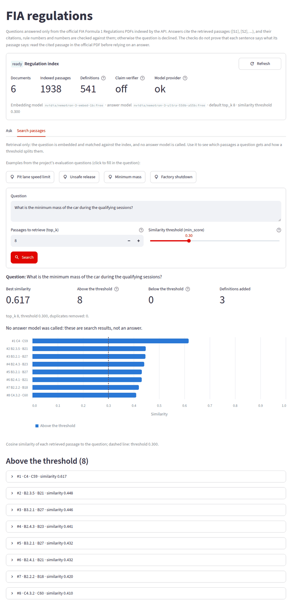

# F1 AI Copilot

F1 AI Copilot is a Formula 1 analysis API built with FastAPI, with a Streamlit web UI. Its core is a **retrieval-augmented question-answering system over the official FIA Formula 1 Regulations**: the PDFs are parsed, chunked, embedded and indexed in Qdrant; questions are answered only from retrieved passages, with `[S#]` citations that are checked against the evidence before an answer is returned. Around it sit explicitly heuristic modules for race strategy, car setup search, telemetry comparison, driver-radio audio analysis, question routing and incident triage.

It is a research/demo project, not an FIA steward tool, a validated vehicle-dynamics simulator or a production race-engineering system. Everything heuristic is labelled as such in the code, in API responses and in the UI.

To use it in your browser on your own computer, see [Run it on your own computer](#run-it-on-your-own-computer); the pages are explained in [docs/ui.md](docs/ui.md).



## Modules

| Module | What it does | Method and scope |
| --- | --- | --- |
| FIA regulation QA | Answers questions from the official 2026 F1 Regulations (Sections A–F) | pypdf ingestion → LangChain text splitting → embeddings (OpenAI or any OpenAI-compatible API) → Qdrant top-k retrieval → similarity threshold → official definitions of the defined terms used → evidence-only generation → deterministic citation/article/number validation (optional model-based claim verification). See [docs/fia-rag.md](docs/fia-rag.md). |
| Strategy engine | Ranks pit-stop plans for the rest of a race | Heuristic lap-time model; searches every compound sequence with 0–3 stops and optimises stint lengths by dynamic programming; continues the currently fitted tyre when its age is given; simplified two-compound rule. Its tyre parameters can be estimated from observed lap history (robust fit with outlier rejection; reports `insufficient_data` instead of guessing) |
| Setup recommender | Suggests wing, ride height, brake bias, differential and suspension values | Seeded Optuna TPE search followed by a deterministic local refinement from three starts, over a documented heuristic lap-time/handling objective with real trade-offs; reports the rule-of-thumb baseline and the objective breakdown (not a vehicle-dynamics simulator) |
| Ghost comparison | Compares two laps of telemetry and renders a PNG | Laps aligned by distance (x/y path or integrated speed), time delta along the lap; missing channels are reported, never filled in |
| Driver-radio emotion | Coarse emotion label for a radio clip | Acoustic heuristic (YIN pitch, energy, spectral features) plus optional local Whisper transcription; not a validated emotion model |
| Natural-language router | Sends a question to the right module | Whole-word keyword routing with documented tie-breaking and routing diagnostics; only uses evidence supplied in the request |
| Incident triage | Preliminary severity/review category for an incident | Transparent deterministic heuristic; never cites FIA article numbers and is not a steward-decision predictor |
| Web UI | One browser page per module, plus an overview of what is ready | Streamlit (`ui/`), a thin HTTP client of the API: it shows the API's results, errors and caveats, and never computes or invents results itself |

## FIA regulation QA in brief

```text
official FIA PDFs ─► validate (manifest SHA-256, %PDF) ─► page text (headers/contents pages removed)
   ─► chunks + metadata (source, page, printed page, section, nearest rule heading)
   ─► embeddings ─► Qdrant (build fingerprint; no stale or duplicate chunks)
   ─► definitions glossary ("TTCS" ─► its verbatim definition), no embeddings needed
question ─► embedding ─► top-k search ─► similarity threshold ─► + definitions of the terms
   the passages use ─► labelled excerpts [S1..Sn] ─► chat model (evidence-only prompt)
   ─► validation: labels exist, ≥1 citation, no uncited statements, rule identifiers and
       numbers present in the cited evidence ─► (optional claim verifier) ─► answer, or decline
```

Retrieval, generation and indexing are separate modules with separate settings: changing `top_k` or the similarity threshold needs no re-indexing, changing the prompt or chat model does not touch the index, and changing chunking or the embedding model marks the index stale until it is rebuilt. Retrieval can be called on its own (`POST /api/fia/retrieve`).

The model is told to answer only from the excerpts and to decline otherwise, and the application enforces it. An answer is replaced by the decline message when it:

* cites a passage that was not retrieved, in any citation style (e.g. `[S9]`, `(S9)`, `[9]`);
* cites nothing, or leaves a statement uncited;
* names an article or appendix that does not occur in the passages it cites, in any common form (e.g. `Art.B9.9`, `Rule 12.4`, `Appendix L`);
* states a number the cited passages do not contain;
* is cut off by the output limit.

With `FIA_RAG_VERIFY_CLAIMS=true` a second model call also checks each sentence against the excerpts it cites. In the real evaluation, a forged-excerpt prompt injection made the chat model answer "according to Article Z1.1 … [S9]" twice; the validator rejected both (details in [docs/fia-rag.md](docs/fia-rag.md#results-with-real-documents-and-models-2026-09-24-to-26)).

## Run it on your own computer

The project runs as two programs on your computer: the API (port 8000) and a web UI (port 8501) that you open in your browser. By default both are reachable only from your computer. The only outside service is the model provider, which the FIA regulation Q&A uses. The UI guide, [docs/ui.md](docs/ui.md), explains every page, result and error message.

| Page | Needs |
| --- | --- |
| Race strategy, Car setup, Ghost car, Driver radio, Incident triage, Ask the copilot (non-rule questions) | Only the installation below |
| FIA regulations (and rule questions on Ask the copilot) | A model-provider API key, the regulation PDFs and a one-time index build (step 4) |
| Radio transcription | Optional: Whisper and ffmpeg |

### 1. Prerequisites

* **Python 3.11, 3.12 or 3.13.** 3.12 is recommended; newer versions are not tested. Get it from [python.org](https://www.python.org/downloads/) (Windows, macOS) or your package manager, and check with `python3 --version` (Windows: `py -3.12 --version`).
* **git**, or download the repository as a ZIP from GitHub and unpack it.
* Optional:
  * **ffmpeg**, for M4A/WebM radio clips and Whisper;
  * **Docker**, for the [Docker Compose](#docker-compose-instead-of-a-python-install) option.

### 2. Get the code and install

macOS and Linux:

```bash
git clone https://github.com/saifrhman/f1-ai-copilot.git
cd f1-ai-copilot
python3.12 -m venv .venv                          # or python3.11 / python3.13
source .venv/bin/activate
python -m pip install -r requirements-lock.txt
cp .env.example .env
```

On Debian or Ubuntu, if creating the venv fails with "ensurepip is not available", run `sudo apt install python3-venv` first.

Windows (PowerShell):

```powershell
git clone https://github.com/saifrhman/f1-ai-copilot.git
cd f1-ai-copilot
py -3.12 -m venv .venv
.venv\Scripts\Activate.ps1
python -m pip install -r requirements-lock.txt
Copy-Item .env.example .env
```

If PowerShell refuses to run `Activate.ps1`, allow local scripts once with `Set-ExecutionPolicy -Scope CurrentUser RemoteSigned`, then activate again.

About these commands:
* `requirements-lock.txt` installs the exact tested versions; `requirements.txt` (direct dependencies only) also works.
* In every new terminal, go to the project folder and activate the venv again (`source .venv/bin/activate`, or `.venv\Scripts\Activate.ps1` on Windows). The commands below are the same on every system.

### 3. Start

```bash
python scripts/run_app.py
```

This starts the API and the UI and opens http://127.0.0.1:8501 in your browser. The API reference is at http://127.0.0.1:8000/docs. **Ctrl+C** in the terminal stops both.

Without a key, every page except FIA regulations works right away. The Overview page shows which components are ready, and gives the next steps for the regulation Q&A.

Options:
* `--ui-port 8601` and `--api-port 8010`: use other ports.
* `--no-browser`: do not open a browser tab.
* `--host 0.0.0.0`: reachable from other devices on your network. Neither server has authentication, so use this only on a trusted network.

You can also start the two servers in two terminals: `uvicorn app.main:app` and `streamlit run ui/streamlit_app.py`.

### 4. Set up the FIA regulation Q&A

**a. Add a model-provider key to `.env`.** The file is git-ignored; never commit it.

* **OpenAI:** set `OPENAI_API_KEY=sk-...`. The defaults `text-embedding-3-small` and `gpt-4o-mini` are used.
* **OpenRouter free models** (used in the project's own evaluation, see [docs/fia-rag.md](docs/fia-rag.md)): set

  ```text
  OPENAI_API_KEY=sk-or-...
  OPENAI_BASE_URL=https://openrouter.ai/api/v1
  FIA_RAG_EMBEDDING_MODEL=nvidia/nemotron-3-embed-1b:free
  FIA_RAG_MODEL=nvidia/nemotron-3-ultra-550b-a55b:free
  FIA_RAG_EMBEDDING_BATCH_SIZE=256
  ```

  Edit the existing lines. The free tier allows **50 requests per day**, and each embedding batch counts as one request. Free model names change: if one is no longer offered, pick another on openrouter.ai.

The similarity threshold (`FIA_RAG_MIN_SCORE=0.30`) was calibrated for the OpenRouter embedding model. With another embedding model, check it with `python scripts/check_fia_rag.py --calibrate`. That uses one embedding request per evaluation question (15), and makes no answer calls.

**b. Stop the app (Ctrl+C) if it is running.** The index storage can be opened by only one program at a time.

**c. Download the regulations and build the index:**

```bash
python scripts/fetch_fia_regulations.py        # latest official PDFs from fia.com into data/fia_docs
python scripts/build_fia_index.py --dry-run    # no provider requests: prints the chunk count and the requests needed
python scripts/build_fia_index.py              # embeds the passages and builds the index
```

The six 2026 PDFs give 1,938 passages, about 431,000 tokens. That is 8 embedding requests at batch size 256, or 16 at the default 128. Parsing takes about a minute. The dry run needs no key.

The embeddings are cached in `.cache/`. Running the build again for unchanged documents reports `up_to_date` and makes no requests.

The PDFs are FIA publications, for private, non-commercial use. They are not part of this repository.

**d. Start again** with `python scripts/run_app.py`. The Overview should now show the regulation QA as `ready`.

Model-provider requests per question:
* one query embedding (none if the same question was asked before);
* one answer call (two with `FIA_RAG_VERIFY_CLAIMS=true`);
* failed calls are retried up to `FIA_RAG_MAX_RETRIES` (default 2) times, and retries count too.

"Search passages" makes only the embedding request.

### Stop, update, rebuild

* **Stop:** Ctrl+C in the `run_app.py` terminal.
* **Update the project:**
  1. `git pull`
  2. `python -m pip install -r requirements-lock.txt`
  3. Start again. If the Overview reports `index_stale`, rebuild as in step 4.
* **Update the regulations:** the FIA publishes new issues during the season.
  1. Stop the app.
  2. Run `python scripts/fetch_fia_regulations.py`, then the two `build_fia_index.py` commands.
  3. Start again.

  Until the rebuild, the Overview reports `index_stale` and the regulation Q&A answers HTTP 503. Passages that did not change are taken from the embedding cache.

### Docker Compose (instead of a Python install)

This needs Docker Desktop (Windows, macOS), or Docker Engine with Compose 2.24 or newer (Linux). `docker-compose.yml` runs three services:
* `api`;
* `ui`;
* `qdrant`: an index server, so there is no single-program lock.

```bash
mkdir -p data/fia_docs .cache outputs
cp .env.example .env                                # add a key as in step 4a for the regulation Q&A
docker compose up -d --build --wait                 # UI http://127.0.0.1:8501, API http://127.0.0.1:8000/docs
docker compose run --rm api python scripts/fetch_fia_regulations.py
docker compose run --rm api python scripts/build_fia_index.py --dry-run
docker compose run --rm api python scripts/build_fia_index.py
```

On Windows (PowerShell), create the folders with `New-Item -ItemType Directory -Force -Path data\fia_docs, .cache, outputs` and copy the file with `Copy-Item .env.example .env`.

On Linux, if your user id (`id -u`) is not 1000, build with `APP_UID=$(id -u) docker compose up -d --build --wait` so that the containers can write to `data/`, `.cache/` and `outputs/`.

Good to know:
* **Settings:** `.env` is read when the containers start and is never copied into the image. After editing it, run `docker compose up -d api`; `docker compose restart api` keeps the old settings.
* **Ports:** published on 127.0.0.1 only.
* **Index:** it lives in the `qdrant` volume, separate from a `.qdrant/` folder built outside Docker. The `.cache/` folder is shared, so texts already embedded are not sent to the provider again.
* **Audio:** the image includes ffmpeg but not Whisper.
* **Stop:** `docker compose down`. `docker compose down -v` also deletes the index.

### Optional: Whisper transcription

`"transcribe": true` on the Driver radio page (or `/api/emotion/classify`) adds a local Whisper transcript to the acoustic heuristic. Without Whisper the response says `"transcription_status": "unavailable"` with the reason and never contains a made-up transcript.

1. Install ffmpeg:
   * macOS: `brew install ffmpeg`
   * Debian/Ubuntu: `sudo apt install ffmpeg`
   * Windows: `winget install Gyan.FFmpeg`, then open a new terminal.
2. With the venv active, install Whisper and check it:

   ```bash
   python -m pip install torch --index-url https://download.pytorch.org/whl/cpu   # Windows/Linux: CPU-only PyTorch, avoids multi-GB CUDA packages
   python -m pip install -r requirements-whisper.txt
   python -m pip uninstall -y triton                                              # optional on CPU-only Linux x86_64: saves ~0.9 GB
   python scripts/check_whisper.py path/to/clip.wav                               # a real transcription test
   ```

3. Restart the app. The Driver radio page then offers "Transcribe with Whisper".

Settings:
* `WHISPER_MODEL`: an official model name (`tiny`, `base` (default), `small`, `turbo`, ...). File paths are not supported.
* `WHISPER_CACHE_DIR`: where the model is downloaded on first use. The default is `~/.cache/whisper`; tiny is about 72 MB and base about 139 MB.

An unknown model name, a missing ffmpeg or a cache directory that cannot be written is reported on the Overview page (and `/health`) before any download.

`check_whisper.py` exits with:
* 0 on success;
* 1 when the audio is rejected or transcription fails;
* 2 on usage errors;
* 3 when Whisper, ffmpeg or the settings are unusable.

On a CPU-only machine, a warm request with `tiny` took about 2 s for a 1–2 s clip.

### Troubleshooting

* **"Could not reach the API":** start it with `python scripts/run_app.py`. If you set `F1_API_URL`, check it.
* **Port already in use:** the launcher names the program when it can. Find it with `lsof -i :8000` (macOS/Linux) or `netstat -ano | findstr :8000` (Windows), or use `--api-port` / `--ui-port`.
* **"Storage folder ... is already accessed by another instance of Qdrant client":** another program, usually the API, has the index open. Stop it, then build.
* **HTTP 503 on the FIA regulations page:** the Overview page names the state (`not_configured`, `index_missing`, `index_stale`, `provider_failing`, ...) and gives the exact commands.
* **HTTP 429, or `provider_failing`:** you hit the provider's quota or rate limit. OpenRouter's free tier allows 50 requests per day, and retries count. Wait for the reset or switch provider; "Search passages" makes no answer calls.
* **Recording from the microphone does nothing:** the browser allows it only at http://127.0.0.1, http://localhost or HTTPS. Upload a file instead.

More in [docs/ui.md](docs/ui.md#troubleshooting).

### For developers

`requirements-rag.txt` installs only what the RAG component, its scripts and its tests need. `python scripts/check_fia_rag.py` runs the end-to-end evaluation with real models (see [Verification](#verification)). The UI talks to the API only over HTTP (`F1_API_URL`); `pip install -r requirements-ui.txt` is enough to run the UI against an API on another machine.

## API

`python scripts/run_app.py` starts the API together with the UI. On its own:

```bash
uvicorn app.main:app            # or: python -m app.main  /  python app/main.py
```

Interactive documentation is at `http://localhost:8000/docs`. `python -m app.main` binds to `HOST`/`PORT` (default `127.0.0.1:8000`).

With embedded Qdrant storage (the default, `QDRANT_PATH=.qdrant`) only one process can open the index: stop the API before rebuilding it, and run a single worker. For several processes (e.g. `uvicorn --workers 2`, or index builds next to a running API) start the Qdrant server in `docker-compose.yml` and point every process at it:

```bash
docker compose up -d --wait qdrant       # Qdrant v1.19 on 127.0.0.1:6333; data in a named volume
export QDRANT_URL=http://127.0.0.1:6333  # or set it in .env
python scripts/build_fia_index.py        # the server starts empty: build the index once
uvicorn app.main:app --workers 2
```

Rebuilds switch the index over atomically: each build writes a new collection and repoints an alias to it, so a running API answers from the complete old index until the switch and from the complete new one after it (see [docs/fia-rag.md](docs/fia-rag.md#qdrant-server-mode-several-processes)).

| Endpoint | Purpose |
| --- | --- |
| `GET /health` | Readiness of every component; `degraded` (HTTP 200) with the reason when the RAG is not ready (`not_configured`, `misconfigured`, `index_missing`/`_stale`/`_incomplete`/`_empty`, `provider_failing`) or artifacts cannot be written |
| `GET /api/fia/status` | Configuration (paths relative to the project, URLs without credentials), documents, index state and `provider_status` (from the latest regulation request, not a live provider check) |
| `POST /api/fia/query` | `{"question": "...", "top_k": 8}` → validated answer, citations mapped to passages with source/page/section and located in the answer text, decline reason |
| `POST /api/fia/retrieve` | `{"question": "...", "top_k": 5, "min_score": 0.3}` → ranked passages with scores, no answer model |
| `POST /api/strategy/generate` | Telemetry lap times, car status, driver profile, tyre data, race state (optionally the fitted tyre and its age), competitors → ranked plans with stints and pit laps |
| `POST /api/strategy/calibrate-tyres` | Lap history (compound, tyre age, lap time; out/in/safety-car laps flagged), weather, track temperature, pit-stop delta, optional fuel correction → estimated `tire_data` per compound (usable as-is in `/api/strategy/generate`), fit statistics, excluded laps, or `insufficient_data` with the reason |
| `POST /api/setup/recommend` | Driver preferences, track profile, weather, optional `n_trials`/`seed` → setup, objective value vs. rule-of-thumb baseline, search and refinement details |
| `POST /api/ghost/generate` | Two laps of telemetry (timestamps and speed required) → distance-aligned delta, zones, PNG under `/artifacts/ghost/` (the only files the API serves) |
| `POST /api/emotion/classify` | Base64 or `data:audio/*` clip, at most 120 s, 2 channels, 8–96 kHz (server file paths are not accepted) → heuristic label, features, transcription status, and how its confidences were computed |
| `POST /api/query/natural` | `{"query": "...", "context": {...}}` → routed answer and routing diagnostics |
| `POST /api/penalty/predict` | Incident type, track condition, intent, optional history → heuristic triage category and severity |

Invalid input returns HTTP 422 with the reason (echoed values are truncated); an unavailable RAG returns 503; unexpected errors return a JSON 500 without internal details. Request bodies are limited while they stream in, chunked uploads included: 40 MiB for the audio routes (`/api/emotion/classify`, `/api/query/natural`), 8 MiB for `/api/ghost/generate`, 1 MiB elsewhere (HTTP 413).

## Verification

```bash
python -m pytest -q
```

The suite (1,442 tests; about 2.5 minutes; CI runs it on Python 3.11 and 3.12) runs without network access or credentials:

* **FIA RAG** (`test_fia_*.py`, 239 tests) – real PDF files generated in the tests, real pypdf parsing, the real LangChain splitter and a real embedded Qdrant; only the embedding and chat services are replaced by a deterministic bag-of-words embedder and a scripted model. Covered: document validation (HTML-as-PDF, corrupt, truncated, empty, unreadable, duplicate, manifest hash and consistency), headers and contents pages, chunk size/overlap and metadata, deterministic chunk IDs, idempotent and stale-aware indexing (each fingerprint input separately), persistence across restarts, top-k and threshold behaviour, fabricated citations in every style, invented or misattributed rule numbers in every common form, uncited statements, numbers absent from the cited evidence, definition extraction/selection/storage, the claim verifier, truncated output, declines, prompt-injection attempts, provider failures, cache corruption, atomic index rebuilds under a concurrent reader, the real OpenAI clients on the wire against a local stub server, and that generation settings and `top_k` never touch the index.
* **Downloader and evaluation harness** (`test_fetch_fia_regulations.py`, `test_check_fia_rag.py`) – latest-issue selection, safe replacement of superseded files, partial `--sections` runs, PDF validation, and checks that the end-to-end evaluation fails when answers are wrong.
* **API** (`test_api_endpoints.py`, 74 tests) – every endpoint's contract (including tyre calibration and its round trip into strategy generation), status codes (413/422/503/500), streaming body limits, NaN literals, lone surrogates and deep nesting, CORS, artifact serving, health states, and RAG endpoints backed by a real in-memory index.
* **Modules** – strategy (lap-accounting invariants on random states, dynamic-programming optimum checked against brute force, last laps, current tyre), setup (search beats the baseline, reproducibility, assumed defaults, validation), ghost (known time deltas recovered across sampling rates), emotion (pitch accuracy on synthetic speech; rejection of silence, noise, non-audio, oversized or high-rate audio and server paths), router (routing, lap references, regulatory declines), triage, tyre calibration (known parameters recovered, contaminated and mixed-pace histories rejected) and Whisper settings.
* **Web UI** (`test_ui_*.py`, 181 tests) – every page run with Streamlit's AppTest against the real API (FastAPI TestClient; the RAG pages against a real in-memory index): rendered values, citations and declines, 422/503/connection errors, client-side input checks, the HTTP client and the `run_app.py` launcher. The pages were also checked in Chrome at phone and desktop widths against the real index (not part of pytest).

Deliberately breaking any of the grounding, fingerprint, manifest, cache, request-limit or evaluation checks makes at least one test fail (14 of 14 such mutations were caught; for the definition, number, uncited-statement and claim-verifier checks 19 of 20, the survivor being an equivalent mutation; for the UI, every one of its fixes when reverted).

End-to-end runs with real documents and models (not part of `pytest`, they need a model provider):

```bash
python scripts/check_fia_rag.py     # results for the 2026 regulations are in docs/fia-rag.md
```

With OpenRouter's free models the last two runs answered all 14 checked questions (answerable, paraphrased, cross-document, unanswerable and adversarial) correctly and declined the DRS trap question. In the latest run the validator first rejected one correct answer because it did not recognise a parenthesised "(Inference: ...)" marker; that is fixed and pinned by a test. The unsafe-release question, which earlier runs declined because "TTCS" was undefined in the retrieved text, is now answered from the added TTCS definition. `python scripts/check_fia_rag.py --calibrate` sweeps the similarity threshold without chat calls. Results, including the claim-verifier test, are in [docs/fia-rag.md](docs/fia-rag.md#results-with-real-documents-and-models-2026-09-24-to-26).

## Configuration

`.env.example` lists every variable. The most relevant:

| Variable | Default | Meaning |
| --- | --- | --- |
| `OPENAI_API_KEY`, `OPENAI_BASE_URL` | – | Model provider (OpenAI or OpenAI-compatible) |
| `FIA_RAG_EMBEDDING_MODEL`, `FIA_RAG_MODEL` | `text-embedding-3-small`, `gpt-4o-mini` | Embedding and chat models |
| `FIA_DOCS_PATH` | `data/fia_docs` | Regulation PDFs |
| `FIA_RAG_CHUNK_SIZE`, `FIA_RAG_CHUNK_OVERLAP` | 1000, 200 | Chunking (characters) |
| `FIA_RAG_TOP_K`, `FIA_RAG_MIN_SCORE` | 8, 0.30 | Retrieval depth and cosine-similarity threshold |
| `FIA_RAG_MAX_DEFINITIONS` | 3 | Official definitions of defined terms added to the evidence (0 disables) |
| `FIA_RAG_VERIFY_CLAIMS` | `false` | Model-based check of every sentence of an accepted answer (one extra chat call) |
| `FIA_RAG_EMBEDDING_BATCH_SIZE` | 128 | Texts per embedding request |
| `FIA_RAG_EMBEDDING_CACHE` | `.cache/fia_embeddings.sqlite3` | Reuse provider vectors for identical text and model (`off` to disable) |
| `FIA_RAG_MAX_OUTPUT_TOKENS` | – | Optional answer-length cap (truncated answers are declined) |
| `QDRANT_URL`, `QDRANT_API_KEY` / `QDRANT_PATH` | – / `.qdrant` | Qdrant server, or embedded storage |
| `CORS_ORIGINS` | `*` | `*` (no credentials) or a comma-separated list of origins |
| `F1_ARTIFACTS_DIR` | `outputs` | Generated images in `<dir>/ghost`, served under `/artifacts/ghost` |
| `HOST`, `PORT` | `127.0.0.1`, `8000` | Bind address for `python -m app.main` (uvicorn takes `--host`/`--port`) |
| `F1_COPILOT_LOAD_DOTENV` | `1` | `0` ignores `.env` (used by the test suite) |
| `F1_API_URL` | `http://127.0.0.1:8000` | Where the web UI finds the API (`run_app.py` sets it) |
| `WHISPER_MODEL`, `WHISPER_CACHE_DIR` | `base`, `~/.cache/whisper` | Optional Whisper transcription model and download directory |

## Limitations

* **FIA QA** is only as current as the downloaded PDFs; PDF extraction flattens tables; the similarity threshold must be calibrated per embedding model (`--calibrate`); definitions are added only for abbreviations the passages use and terms the question names; the deterministic validation proves that citations, rule identifiers and numbers come from the cited evidence, not that the evidence entails every sentence (the optional verifier adds a model judgement for that). Check high-stakes interpretations against the official documents.
* **Strategy** and **setup** use hand-set heuristic models, not team models or vehicle simulation; fuel, traffic, safety cars and weather changes are not simulated, and inputs that are accepted but not modelled are listed in each response. Tyre calibration fits the engine's own tyre model to one car's laps in one session's conditions; its guards catch clearly mixed or contaminated histories, not every second population (see `core_modules/strategy_optimizer/README.md`). The setup, emotion and triage heuristics are not calibrated against real outcomes: that would need labelled data (setups with measured lap times, rated radio clips, steward decisions) that the project does not have.
* **Emotion** labels come from hand-set acoustic thresholds and depend on recording gain; they are not psychological assessments.
* **Incident triage** is a severity heuristic, not a prediction of steward decisions.
* The API has no authentication; bind it to localhost or put it behind an authenticating proxy.

## Repository structure

```text
app/main.py                          FastAPI application
ui/streamlit_app.py                  Streamlit web UI entry point (pages in ui/views/, HTTP client in
                                     ui/api_client.py, settings in ui/.streamlit/config.toml)
core_modules/
  rule_checker/fia_rag/              FIA regulation RAG (config, errors, ingestion, embeddings, index,
                                     glossary, retrieval, generation, grounding, rules, pipeline)
  rule_checker/fia_files.py          official FIA file names (shared by the downloader and the RAG)
  rule_checker/penalty_predictor.py  incident triage (+ schemas.py)
  strategy_optimizer/                strategy engine, tyre calibration (+ schemas.py, example, README)
  setup_optimizer/                   setup recommender (+ schemas.py)
  ghost_car/                         telemetry comparison (+ schemas.py)
  driver_emotion/                    radio emotion analysis (+ schemas.py)
  llm_query/natural_query.py         natural-language router
scripts/
  run_app.py                         start the API and the web UI together
  fetch_fia_regulations.py           official FIA PDF downloader
  build_fia_index.py                 index build / dry run
  check_fia_rag.py                   end-to-end evaluation and threshold calibration (+ fia_rag_eval_questions.json)
  check_whisper.py                   real Whisper transcription check
tests/                               pytest suite (python -m pytest -q)
docs/fia-rag.md                      RAG design, operation and evaluation
docs/ui.md                           web UI guide (pages, results, troubleshooting)
requirements*.txt                    pinned dependencies (+ requirements-lock.txt; requirements-ui.txt for the UI alone)
Dockerfile, docker-compose.yml       container image; Compose stack with the API, the UI and a Qdrant server
```

## Licensing

This repository does not include a license file. The FIA regulation PDFs are FIA Publications: FIA's website terms reserve their copyright and allow private, non-commercial copies. They are downloaded by the helper script for local use, are git-ignored and are not redistributed here.
